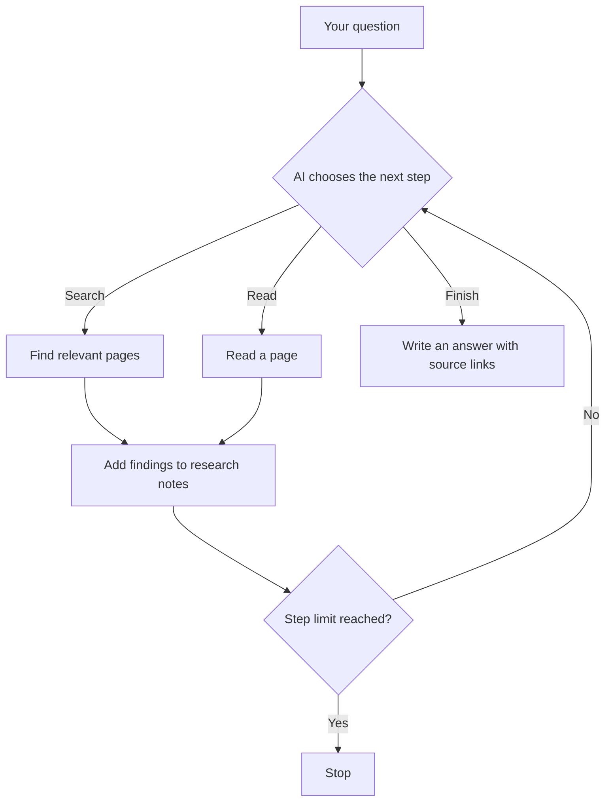

# Web Research & Briefing Agent

This is a ReAct-style action/observation loop using a small JSON protocol. The AI chooses whether to search, read a page, or finish with an answer. Python validates the decision, returned as a JSON object, and carries it out. Search results and page contents are sent back to the AI to inform its next decision.

- **State:** the program keeps track of the question, previous actions, findings, and step count during each run.
- **Validation:** only the three supported actions are accepted. If the AI sends an invalid request, it gets one chance to correct it.
- **Execution:** failed searches or page reads are reported back to the AI so it can try another approach. The program stops after a fixed number of research steps.
- **Output:** the AI is instructed to include source links and say when there isn’t enough evidence.

## How it works

- You enter a research question.
- The AI chooses what to do next: search, read a page, or write an answer.
- The program checks that choice and carries it out.
- Results help the AI decide its next step.
- The process repeats until the AI finishes or the program reaches its step limit.

- **The AI makes choices:** it can change direction based on what it finds.
- **The program sets boundaries:** it allows only supported actions and stops after 20 research steps.
- **Errors become feedback:** if a search or page fails, the AI can try another source.

## What powers it

- **Python:** coordinates the research steps and keeps track of findings.
- **Ollama:** runs the AI model on the local computer.
- **DuckDuckGo:** finds web pages.
- **Trafilatura:** pulls readable article text from web pages.
- **A terminal interface:** accepts a question and displays the answer.

## Current limits

- Answers and source links need human review; accuracy is not automatically verified.
- Searches can be rate-limited, and local model responses can be slow.
- Reports are displayed but not saved automatically. Interrupted research cannot be resumed.

## Next improvements

- Show each research step and how long it takes.
- Save reports and research history.
- Remove repeated information sent to the model and prevent repeated searches.
- Check source links and compare answer quality across a small set of test questions.
- Set a total time limit and keep partial findings if time runs out.

## Keeping it runnable

- Python and package versions are recorded so the same environment can be recreated.
- Startup keeps those versions unchanged unless they are deliberately updated.
- Ollama and its model files are managed separately; websites can still change.
- See [OPERATIONS.md](OPERATIONS.md) for setup, start/stop commands, and troubleshooting.
